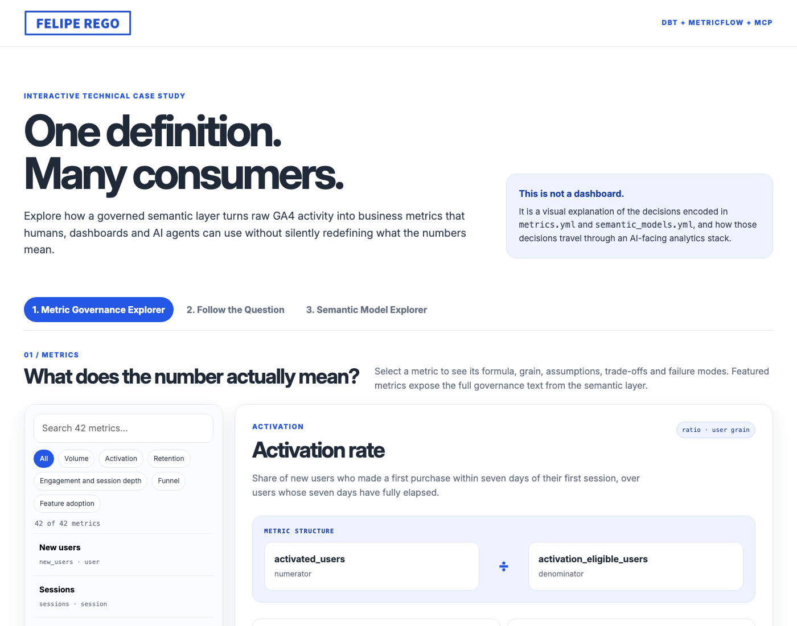
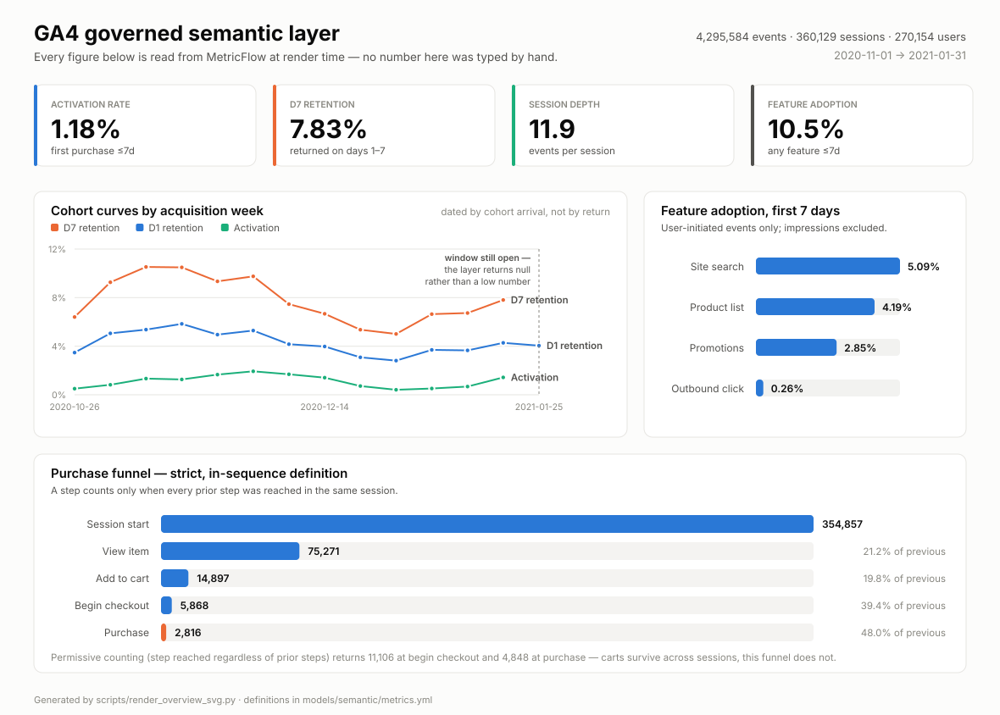

# A governed GA4 semantic layer, queryable by humans and by agents

[](https://github.com/FelipeRego/dbtBigQuery/actions/workflows/ci.yml)
[](https://docs.getdbt.com/)
[](https://docs.getdbt.com/docs/build/about-metricflow)
[](https://modelcontextprotocol.io/)
[](LICENSE)

> **[▶ Open the interactive explorer](https://feliperego.github.io/dbtBigQuery/)** —
> browse all 42 metrics with their definitions, assumptions and failure modes,
> follow one question from an LLM through the MCP server to BigQuery, and see
> which dimensions each semantic model allows. No install, no login.

[](https://feliperego.github.io/dbtBigQuery/)

A dbt project over Google's public GA4 ecommerce sample that defines the
product-analytics metrics people actually argue about — activation, retention,
feature adoption, session depth, funnel conversion — and then puts an MCP server
in front of them so an LLM answers *"what's D7 retention for mobile users
acquired in November?"* by traversing the metric graph instead of writing SQL.

**The README is the deliverable.** Not the models. Anyone can aggregate GA4
events; the hard part is deciding what a number means, writing the decision
down, and making it impossible for the definition and the dashboard to drift
apart. That's what the [metric dictionary](#the-metric-dictionary) below is for,
and every definition in it is generated from the same YAML the warehouse and the
agent read.

| | |
| --- | --- |
| **Source** | `bigquery-public-data.ga4_obfuscated_sample_ecommerce`, 2020-11-01 to 2021-01-31 |
| **Scale** | 4,295,584 events → 360,129 sessions → 270,154 users |
| **Stack** | dbt-core 1.12 · dbt-bigquery 1.12 · MetricFlow 0.213 · MCP Python SDK 2.2 |
| **Models** | 7 models + 1 seed (1 staging, 1 intermediate, 4 marts, 1 time spine) |
| **Tests** | 98 data tests, all passing — including one that cannot pass vacuously |
| **Metrics** | 42 defined in MetricFlow, each with a four-part governance block |
| **Cost** | 6.75 GiB billed per full build, across 106 query jobs. BigQuery's free 1 TiB/month covers ~150 builds |



*Generated by `scripts/render_overview_svg.py`, which queries MetricFlow at
render time — no figure in it was typed by hand. Note the right-hand edge of the
cohort chart: the final week is blank because the seven-day window has not
closed, and the semantic layer returns null rather than a misleadingly low
number.*

---

## Contents

- [The claim](#the-claim)
- [How it was built](#how-it-was-built)
- [The toolchain](#the-toolchain)
- [The metric dictionary](#the-metric-dictionary)
- [Five things the data changed my mind about](#five-things-the-data-changed-my-mind-about)
- [Architecture](#architecture)
- [The agent layer](#the-agent-layer)
- [Testing: the day 97 tests passed against six empty tables](#testing-the-day-97-tests-passed-against-six-empty-tables)
- [Running it yourself](#running-it-yourself)
- [The BI layer](#the-bi-layer)
- [What this demonstrates](#what-this-demonstrates)
- [What this project does not do](#what-this-project-does-not-do)

---

## The claim

Most analytics repos answer "can you build a star schema?". That question was
settled twenty years ago. The question that isn't settled is what happens when
four teams each need "activation rate" and nobody wrote down which seven days
they meant.

This project takes a position on that. Three things follow from it:

**1. A definition lives in exactly one place.** `models/semantic/metrics.yml`
holds the metric, its assumption, the trade-off accepted when it was chosen, and
what breaks if someone chooses differently. dbt compiles that into the semantic
manifest. The MCP server reads the manifest and hands the governance block back
with every number. `scripts/render_metric_docs.py` renders the same text into
the dictionary below, and CI fails if the README drifts. There is no second copy
to forget to update.

**2. Eligibility is inside the measure, not left to the caller.** A user whose
first session was three days before the data ends has had three days to
activate, not seven. Counting them drags activation down for reasons that have
nothing to do with the product — and does it worst in the most recent cohorts,
which is exactly where people look for a trend. So `activated_users` is defined
as:

```sql
case when is_activated
      and not is_left_censored
      and has_full_activation_window
     then 1 else 0 end
```

An analyst cannot forget the exclusion, because no measure exists that omits it.
19,300 users are excluded from activation on this dataset for having an open
window, and 8,417 more for predating the loaded window entirely.

**3. The agent gets metrics, not a SQL prompt.** The MCP server exposes seven
tools. None of them accepts SQL. Ask it for a metric that doesn't exist and it
refuses, names the 42 that do, and tells the model that the metric would need to
be defined and reviewed first. An LLM with warehouse credentials will cheerfully
compute D7 retention three different ways across three conversations and present
all three with equal confidence. This one can't.

---

## How it was built

Eight stages, in order. Each one produced something the next depended on, and
each involved a decision worth defending rather than a default worth accepting.

### 1. Reconnaissance, before writing any dbt

Three queries against the raw export, to find out what the property actually
fires rather than what the GA4 documentation says it might:

```sql
select event_name, count(*) from `bigquery-public-data.ga4_obfuscated_sample_ecommerce.events_*`
group by 1 order by 2 desc
```

Seventeen distinct event names, three device categories, six traffic mediums.
This is why `seeds/feature_catalogue.csv` maps `select_promotion` and not
`view_cart`: `view_cart` and `add_to_wishlist` are standard GA4 recommended
events that this property never fired once in 92 days. Cataloguing them would
have produced a permanent zero that reads like a product failure.

It also surfaced that `view_promotion` fires 190,104 times against 9,450
`select_promotion` clicks — the 20:1 ratio that forced the
impression-versus-action distinction into the seed file.

### 2. Staging — one row per event, and no opinions

`models/staging/stg_events.sql`. Typing, renaming, and promoting the useful
`event_params` keys to real columns. 4,295,584 rows.

GA4 stores per-event attributes in a repeated `STRUCT`, so every field needs an
unnest-and-filter. Rather than repeat that eight times, the pattern lives in
`macros/ga4_event_params.sql`:

```sql

    (select ep.value.int_value from unnest(event_params) ep where ep.key = '{{ key }}' limit 1)

```

The `limit 1` is load-bearing — GA4 does not guarantee a key appears once per
event, and without it the build dies mid-run on a scalar-subquery error.

Two decisions here. Staging is materialised as a **table, not a view**, so the
three models that reference it read a local table instead of re-scanning 2.9
GiB of the public dataset each time. And `traffic_source` is renamed to
`first_touch_*`, because in the BigQuery export it describes how the *user* was
first acquired, not where the current session came from — the single most
common error built on this dataset.

### 3. Intermediate — sessionisation and the cohort anchor

`models/intermediate/int_sessions.sql`. 360,129 rows, one per session.

This is where the window functions live: `LAG` over events within a session to
detect inactivity gaps, `QUALIFY ROW_NUMBER()` to take session attributes from
the chronologically first event rather than an arbitrary row, and
`ARRAY_AGG(... IGNORE NULLS ORDER BY ... LIMIT 1)` for the landing page.

Two things are computed here precisely so that nothing downstream has to
recompute them and risk disagreeing:

- **`days_since_first_session`** — one elapsed-time axis, shared by activation,
  retention and feature adoption.
- **`is_left_censored`** — GA4's own `user_first_touch_timestamp` compared
  against the window start, which identifies the 8,417 users whose "first
  session" here is an artefact of where the data was cut.

### 4. Marts — four tables at three grains

| Model | Grain | Rows | Carries |
| --- | --- | ---: | --- |
| `fct_events` | event | 4,295,584 | cohort context and feature classification on every event |
| `dim_users` | user | 270,154 | activation, retention and the eligibility flags |
| `fct_sessions` | session | 360,129 | engagement, depth, acquisition |
| `fct_funnel` | session × step | 1,800,645 | five dense rows per session |

`fct_funnel` is deliberately dense — five rows per session whether or not the
step was reached — so step-to-step conversion is a ratio of two counts over one
table, and a step with no traffic on a given day appears as a zero instead of
vanishing from the chart.

### 5. Tests — 98 of them, and one that cannot pass vacuously

Uniqueness and not-null on every key, `accepted_values` on every enumerated
dimension, `relationships` across all four marts, `dbt_utils.accepted_range` on
every count and duration, and model-level `expression_is_true` assertions for
the invariants that encode actual business logic.

Plus `tests/assert_models_are_not_empty.sql`, which exists because of a real
failure documented [below](#testing-the-day-97-tests-passed-against-six-empty-tables).

### 6. Semantic layer — 4 semantic models, 42 metrics

`models/semantic/`. Entities, dimensions and measures in
`semantic_models.yml`; metrics in `metrics.yml` (955 lines, most of it prose).

The technique that matters: **eligibility is compiled into the measure
expression**, not left as a filter the caller must remember.

```yaml
- name: activated_users
  description: >
    Eligible users whose first purchase landed inside the activation
    window. Eligibility is inside the expression on purpose.
  agg: sum
  expr: "case when is_activated and not is_left_censored and has_full_activation_window then 1 else 0 end"
```

And the governance text rides along in `config.meta`, so dbt compiles it into
`target/semantic_manifest.json` where both the docs generator and the MCP server
can read it.

### 7. Agent interface — MCP server, seven tools, no SQL

`mcp_server/server.py`, 642 lines. Reads the compiled manifest for metric
metadata; shells out to the MetricFlow CLI for the numbers. Every response that
carries a figure also carries that figure's definition, assumption, trade-off
and failure mode.

Unknown metrics are refused with a structured payload naming the 42 that exist —
returned, not raised, so the model learns what it may ask for instead of seeing
an opaque tool error.

### 8. Documentation and CI — closing the drift loop

Three generators and a workflow:

- `scripts/render_metric_docs.py` renders the metric dictionary from the
  manifest, with a `--check` mode that fails CI if the README has drifted.
- `scripts/render_overview_svg.py` builds the chart at the top of this README
  from live `mf query` calls, so the picture cannot contradict the metrics.
- `scripts/smoke_test_mcp.py` launches the server as a subprocess and drives it
  over a real stdio MCP session, asserting that governance travels with every
  number and that no raw-SQL tool exists.
- `.github/workflows/ci.yml` runs all of the above without warehouse
  credentials, because `dbt parse` validates models, semantic models and metrics
  against each other without opening a connection.

---

## The toolchain

| Tool | Version | What it does here | Why this one |
| --- | --- | --- | --- |
| **BigQuery** | sandbox tier | Warehouse. Source dataset plus seven built models and one seed | Free without a credit card, and the GA4 sample lives there. Its constraints shaped real decisions — see the partitioning story |
| **dbt-core** | 1.12.5 | Transformation, testing, lineage, documentation, exposures | The lingua franca of analytics engineering. Everything here is portable to any dbt warehouse |
| **dbt-bigquery** | 1.12.1 | Adapter: partitioning, clustering, `maximum_bytes_billed` | — |
| **dbt_utils** | 1.4.1 | `generate_surrogate_key`, plus the `accepted_range` and `expression_is_true` assertions | dbt core ships `unique`, `not_null`, `accepted_values` and `relationships`; these are the two assertion types it does not, and both are load-bearing here |
| **MetricFlow** | 0.213.0 (CLI 0.15.0) | The metric engine: semantic models, ratio and filtered metrics, cohort time dimensions, the join graph | The open-source engine behind the dbt Semantic Layer. Metrics compile to SQL rather than being reimplemented per tool |
| **MCP Python SDK** | 2.2.0 | The agent interface, over stdio | The emerging standard for exposing tools to LLMs. Works with any MCP client |
| **uv** | 0.10.12 | Environment and dependency management, lockfile-backed | Fast, and `--managed-python` sidesteps whatever interpreter the machine happens to have — which mattered here, since the system Anaconda build crashes dbt with SIGBUS |
| **Python** | 3.12.13 | MCP server (642 lines) plus three tooling scripts — two doc generators and an MCP integration test (734 lines) | — |
| **Ruff** | 0.16.8 | Lint and format, enforced in CI | — |
| **GitHub Actions** | — | Parse, drift-check, agent-surface guard, lint | Runs credential-free, so a fork gets a green build without a GCP account |
| **Google Cloud SDK** | 585.0.0 | `scripts/setup_gcp.sh` — project creation, API enablement, ADC | Makes the whole thing reproducible from one command |
| **Power BI** | — | The BI consumer, declared as a dbt exposure | The one consumer that reads the marts directly, and therefore the one that needs written rules |

A few choices worth the sentence:

**Why MetricFlow and not just well-named dbt models.** A model can encode a
metric, but it cannot encode a *ratio over a dynamic group-by*. Activation rate
sliced by acquisition channel, device and cohort week is one metric definition
in MetricFlow and one SQL compilation per question; as models it is either a
cube with every combination pre-computed or a BI tool re-deriving the numerator
each time. The whole governance argument depends on there being exactly one
definition, and MetricFlow is what makes that mechanically true.

**Why MCP and not a chat wrapper over the warehouse.** A text-to-SQL agent with
warehouse credentials is faster to build and produces answers that cannot be
audited. Wiring the agent to the metric layer instead means the set of
answerable questions is exactly the set of governed metrics — and the ones
outside it come back as an explicit refusal rather than a plausible guess.

**Why no incremental models.** dbt's incremental strategy on BigQuery emits
`MERGE`, which the free sandbox does not support. At 4.3m rows and a 75-second
full refresh, incrementality would be complexity without benefit. Stating that
is the engineering decision; reaching for incremental because it looks advanced
would have been the mistake.

---

## The metric dictionary

Each metric below states four things: what it means, the assumption it rests on,
the trade-off accepted when it was chosen over the obvious alternative, and what
breaks if someone defines it differently. The fourth is the one that matters.
It's the difference between a definition and a warning label.

<!-- BEGIN GENERATED METRIC DICTIONARY -->

> Generated from `models/semantic/metrics.yml` by `scripts/render_metric_docs.py`. Do not edit by hand — edit the YAML and re-run `dbt parse`. CI fails if this section drifts.

### Activation

#### `activation_rate` — Activation rate

*ratio metric, user grain.*

**Definition.** activated_users / activation_eligible_users. A user activates when their first purchase falls within `activation_window_days` of their first observed session. Both sides of the ratio exclude left-censored users and users whose window has not closed.

**Assumption.** Purchase is the activation moment, and seven days is long enough for a genuinely interested buyer to get there. For a merchandise store where most of the catalogue is under $50, that is defensible; for a considered purchase it would not be.

**Trade-off.** Chosen over "any add-to-cart" because add-to-cart survives neither bot traffic nor idle curiosity — it is cheap to trigger and does not commit the user to anything, so it measures interest rather than value delivered. Purchase is expensive to fake and unambiguous. The cost is real: slow-considered categories look worse than they are, because a user who returns on day nine to buy a $300 item is counted as a failure. A second cost is that this metric can only move when checkout works, so it conflates product-market fit with payment reliability.

**Breaks if.** Someone widens the window to 30 days to make the number look better. On this dataset that moves activation from 1.18% to 1.57% — a third higher, and less than most people expect, because the buyers who were going to buy mostly did so quickly. The real cost is elsewhere: the eligible population falls from 242,437 users to 173,333, a 28% drop, because every cohort from the last 30 days leaves the denominator. The series gets shorter at the same time as it gets higher, and a 30-day window cannot tell you on Tuesday that Monday's release broke onboarding.

#### `avg_days_to_first_purchase` — Average days to first purchase

*simple metric, user grain.*

**Definition.** Mean of days_to_first_purchase across users who ever purchased.

**Assumption.** Non-purchasers are excluded rather than counted as infinite. This makes the metric a diagnostic for "how long should the activation window be", not a measure of how well the funnel works.

**Trade-off.** A mean over purchasers is badly skewed by a small number of long considerers. It is published because its shape justifies the choice of a seven-day activation window, not because it is a good KPI.

**Breaks if.** Someone reads it as "the average customer buys in N days". It is the average of those who bought at all, which is a much smaller and much keener population.

### Retention

#### `d7_retention_rate` — D7 retention rate

*ratio metric, user grain.*

**Definition.** d7_retained_users / d7_eligible_users. A user is retained if they had at least one session on any of days 1-7 after their first session. Day 0 is excluded.

**Assumption.** Returning at all is the signal. A user who returns on day 2 for eight seconds and bounces counts exactly the same as one who returns daily.

**Trade-off.** This is "bounded" or "rolling" D7 — any return in the first week — chosen over "classic" D7, which counts only users active on day 7 exactly. Bounded D7 is far less noisy on small cohorts and matches how most people describe retention out loud. The cost is that it is structurally higher than classic D7 and not comparable to a competitor's number without asking which one they mean. Day 0 is excluded because a same-day return is part of the acquisition visit, not evidence of habit.

**Breaks if.** Someone compares it with a classic day-7-exact figure, or includes day 0. Including day 0 returns exactly 100% — not approximately, exactly — because every eligible user has a session on day 0 by construction: it is the session that put them in the cohort. A retention metric that reads 100% for every segment on every day is the clearest possible signal that day 0 crept into the numerator.

#### `d1_retention_rate` — D1 retention rate

*ratio metric, user grain.*

**Definition.** d1_retained_users / d1_eligible_users, where day 1 means the calendar day after the first session.

**Assumption.** Calendar days, in the property's reporting timezone, not rolling 24-hour periods.

**Trade-off.** Calendar-day bucketing means a user who arrives at 23:50 and returns at 00:10 counts as retained after 20 minutes. Rolling 24-hour windows would be fairer but do not line up with how the cohort chart is drawn.

**Breaks if.** The property's reporting timezone changes. Every day boundary moves, and historical D1 shifts without any code changing.

#### `d30_retention_rate` — D30 retention rate

*ratio metric, user grain.*

**Definition.** d30_retained_users / d30_eligible_users.

**Assumption.** The same bounded definition as D7, over a 30-day window.

**Trade-off.** On a 92-day dataset, requiring a full 30-day window discards the last third of the cohorts. The metric is included for completeness but the eligible population is small enough that segment-level cuts get noisy fast.

**Breaks if.** Someone slices it by channel and campaign at once. The eligible population is roughly a third of the dataset before any filtering.

### Feature adoption

#### `feature_adoption_rate` — Feature adoption rate (first 7 days)

*ratio metric, user grain.*

**Definition.** feature_adopters_7d / adoption_base_users. A user adopts a feature when they fire an event mapped to it in seeds/feature_catalogue.csv with is_user_initiated = true, within seven days of their first session.

**Assumption.** The feature catalogue is complete and correctly classified. It is a hand-maintained seed file; a feature nobody added to it has an adoption rate of zero by construction, not by evidence.

**Trade-off.** Impression events are excluded. `view_promotion` fires 190,104 times in this sample against 9,450 `select_promotion` clicks — a 20:1 ratio — so counting impressions would report promotions adoption near 100% and mean nothing. The cost is that a feature whose value is being *seen* rather than clicked cannot be measured this way at all. The seven-day window is inherited from the activation definition so the two metrics can be read on the same axis. That is a convenience, not a finding: nothing says feature adoption and first purchase operate on the same clock.

**Breaks if.** Someone groups this metric by feature_name. A ratio metric's group-by applies to the denominator as well as the numerator, so grouping by feature turns the denominator from "all eligible users" into "eligible users who used this feature" — and the ratio collapses towards 1. On this dataset it returns 96% for site_search, against the true 5.1%. The four per-feature metrics avoid this by filtering the numerator only, which is why they exist as separate metrics rather than as a slice of this one. It also breaks if someone removes the is_user_initiated filter or flags an impression event as user-initiated: adoption then jumps towards 100% and the metric silently becomes a measure of page traffic.

#### `feature_adoption_rate_site_search` — Feature adoption rate — site search

*ratio metric, user grain.*

**Definition.** feature_adoption_rate filtered to the site_search feature (event view_search_results).

**Assumption.** Seeing a search result set means the user searched deliberately.

**Trade-off.** Search is the clearest case of a user-initiated feature in this property, which is why it is broken out. Note that a user who typed a query returning zero results still counts as an adopter.

**Breaks if.** The site adds an auto-suggest panel that fires view_search_results on keystroke. Adoption then measures typing, not searching.

#### `feature_adoption_rate_promotions` — Feature adoption rate — promotions

*ratio metric, user grain.*

**Definition.** feature_adoption_rate filtered to the promotions feature. Counts select_promotion only; view_promotion is catalogued as an impression and excluded.

**Assumption.** A promotion click is a deliberate act of engagement with merchandising.

**Trade-off.** This is the metric that most clearly demonstrates why the impression/action distinction is in the catalogue at all — the two event types differ by 20x in this sample.

**Breaks if.** view_promotion is reclassified as user-initiated. The rate leaps and the metric stops distinguishing merchandising that works from merchandising that merely renders.

#### `feature_adoption_rate_product_list` — Feature adoption rate — product list

*ratio metric, user grain.*

**Definition.** feature_adoption_rate filtered to product_list (event select_item).

**Assumption.** A click from a list is navigation *and* a feature interaction. This is the weakest of the four feature definitions — browsing a category is arguably just using the site.

**Trade-off.** Included because it is the highest-volume user-initiated feature signal in this property and gives the adoption chart a baseline to read the others against.

**Breaks if.** Read as evidence that a discovery feature is working. It largely measures ordinary navigation.

#### `feature_adoption_rate_outbound_click` — Feature adoption rate — outbound click

*ratio metric, user grain.*

**Definition.** feature_adoption_rate filtered to outbound_click (GA4's automatic `click` event).

**Assumption.** An outbound click is a deliberate action worth measuring.

**Trade-off.** Only 1,446 such events exist in the whole sample, so this metric is included mainly as a worked example of a low-volume feature: the rate is near zero and any segment cut of it is noise. A metric that cannot support the slices people will want is worth labelling as such before somebody builds a dashboard on it.

**Breaks if.** It is sliced by anything. At this volume a single day's segment can swing the rate by an order of magnitude.

### Session depth and engagement

#### `session_depth` — Session depth (events per session)

*ratio metric, session grain.*

**Definition.** Total events divided by total sessions.

**Assumption.** All events are equally meaningful. They are not — `user_engagement` and `scroll` together are 36% of the event volume in this dataset, and both fire without the user deciding anything.

**Trade-off.** Events per session was chosen over page views per session because it captures interaction on single-page flows that never fire a second page_view. The cost is that the number is dominated by automatic events, so it moves when GA4's tagging changes even though user behaviour did not.

**Breaks if.** Someone compares session depth across a tagging change. Adding a single new automatic event to the site raises this metric everywhere, overnight, with no behavioural change whatsoever.

#### `engagement_rate` — Engagement rate (GA4 definition)

*ratio metric, session grain.*

**Definition.** engaged_sessions / sessions, where engagement is GA4's own client-side flag: the session lasted over 10 seconds, or had a conversion, or had two or more page views.

**Assumption.** The client-side flag arrived intact.

**Trade-off.** Chosen over the independently derived definition so that the number reconciles with the GA4 UI. `engagement_rate_derived` computes the same rule server-side, and the difference between the two is a direct measure of how much client-side signal is being lost.

**Breaks if.** Compared with engagement_rate_derived without saying which is which. They answer the same question through different plumbing and will not agree.

#### `engagement_rate_derived` — Engagement rate (derived definition)

*ratio metric, session grain.*

**Definition.** engaged_sessions_derived / sessions, where engagement is recomputed from the event stream: duration >= 10s OR page_views >= 2 OR a purchase occurred.

**Assumption.** Duration measured as last-event minus first-event is a fair proxy for time on site. It is not, for a single-event session, which always measures zero.

**Trade-off.** Published purely as a control on the GA4 flag. Using it as the headline engagement number would mean explaining to every stakeholder why it does not match the GA4 UI.

**Breaks if.** It becomes the default without the comparison being documented.

#### `sessionisation_disagreement_rate` — Sessionisation disagreement rate

*ratio metric, session grain.*

**Definition.** sessions_split_by_gap / sessions, where a session is "split" if any two consecutive events in it are more than `session_gap_minutes` (default 30) apart.

**Assumption.** A 30-minute gap means the user left. It might instead mean a tab sat open in the background, which GA4's own timeout should have ended.

**Trade-off.** This is a data-quality metric, not a product metric. It exists so that the choice to adopt GA4's session boundaries can be defended with a number instead of a shrug.

**Breaks if.** It is put on a business dashboard. It answers a question about instrumentation that no commercial stakeholder asked.

### Funnel

#### `purchase_conversion_rate` — Session purchase conversion rate

*ratio metric, session grain.*

**Definition.** sessions_reaching_purchase / sessions_starting_funnel, both using the strict in-sequence definition: a step counts only when every prior step was also reached in the same session.

**Assumption.** The user journey is view_item then add_to_cart then begin_checkout then purchase, within one session. Cross-session journeys — research on mobile, buy on desktop next day — are invisible to this metric.

**Trade-off.** Strict sequencing was chosen over permissive step-reach because the permissive version produces conversion rates above 100% at the cart step: GA4 fires add_to_cart from category pages without a preceding view_item. The cost is that the strict version undercounts genuine cart adds, so the absolute rate is conservative. Both measures are published; the strict one is wired to the metric.

**Breaks if.** Someone builds the same funnel on `is_reached` instead of `is_reached_in_sequence`. On this dataset that moves begin_checkout from 5,868 sessions to 11,106 and purchase from 2,816 to 4,848 — the permissive counts are 89% and 72% higher respectively. The gap is concentrated at checkout, not at the cart, because carts persist across sessions while this funnel does not: a user who adds to cart on Monday and checks out on Tuesday has a Tuesday session that begins checkout with no preceding cart add. Neither number is wrong; mixing them inside one chart is.

#### `checkout_completion_rate` — Checkout completion rate

*ratio metric, session grain.*

**Definition.** sessions_reaching_purchase / sessions_reaching_begin_checkout, both strict in-sequence.

**Assumption.** Checkout abandonment is a product problem. Some of it is payment failure, which this dataset cannot distinguish.

**Trade-off.** The narrowest funnel step pair, and therefore the most actionable — but also the one with the smallest denominator, so daily slices get noisy quickly.

**Breaks if.** Sliced by channel and device at once on a single day. On this dataset the begin_checkout population is under 500 sessions a day.

### Commercial

#### `revenue` — Revenue (USD)

*simple metric, event grain.*

**Definition.** Sum of ecommerce.purchase_revenue_in_usd across purchase events. Item revenue, shipping and tax are excluded.

**Assumption.** Every purchase event represents a real, completed order. The GA4 export has no refund or cancellation signal in this sample, so returns are invisible.

**Trade-off.** Taken at event grain rather than from the item array, because the item array double-counts when a purchase event carries both order-level and line-level revenue. The cost is that no product-level revenue split is possible from this metric.

**Breaks if.** Someone sums revenue from fct_funnel. Session revenue is repeated onto all five step rows, so the total comes out five times too high.

#### `transactions` — Transactions

*simple metric, session grain.*

**Definition.** Distinct transaction_id values observed on purchase events.

**Assumption.** transaction_id is populated and unique per order.

**Trade-off.** Counted from distinct transaction_id *within a session*, then summed across sessions. That removes the duplication caused by reloading an order-confirmation page inside one visit, but not duplication across visits. On this dataset the three numbers are: 5,692 purchase events, 5,258 session-scoped distinct transactions (this metric), and 4,452 globally distinct transaction ids. The 806-order gap is order confirmations reopened in a later session.

**Breaks if.** It is read as "orders placed". It is closer to "order confirmations seen, deduplicated within a visit". For a true order count, take count(distinct transaction_id) across the whole period — which this semantic layer deliberately does not expose as an additive measure, because a distinct count cannot be summed across time buckets.

#### `average_order_value` — Average order value (USD)

*ratio metric, session grain.*

**Definition.** Total session revenue divided by distinct transactions.

**Assumption.** Revenue and transaction counts cover the same set of orders.

**Trade-off.** Both sides are taken at session grain so they cannot drift apart under grouping. The cost is that the denominator is session-scoped distinct transactions, so this reports $68.88 on the full dataset where a globally deduplicated order count would report $81.35. The session-scoped version was chosen because it stays correct when the metric is sliced by day or by channel; the global one does not.

**Breaks if.** It is compared against an order-management system's AOV. That system counts orders once; this counts order confirmations once per visit.

#### `revenue_per_session` — Revenue per session (USD)

*ratio metric, session grain.*

**Definition.** Total session revenue in USD divided by total sessions.

**Assumption.** Revenue belongs to the session in which the purchase event fired.

**Trade-off.** Last-click within-session attribution. A user who researched across four sessions and bought in the fifth gives all the credit to the fifth. Multi-touch attribution is out of scope on a dataset whose traffic source is user-scoped and partly obfuscated.

**Breaks if.** Used to compare acquisition channels. Because GA4's traffic_source is first-touch and user-scoped, every session a user ever has is credited to the channel that first acquired them, so this will systematically flatter whichever channel wins first contact.

### Population

#### `new_users` — New users

*simple metric, user grain.*

**Definition.** A distinct user_pseudo_id whose first observed session falls inside the loaded window, excluding users GA4 says it had already seen before the window opened.

**Assumption.** user_pseudo_id is a person. It is not — it is a browser on a device. One human on a laptop and a phone counts twice, and clearing cookies creates a new "new user".

**Trade-off.** Chosen over GA4's own `first_visit` event count because first_visit fires on the client and is lost whenever the event is blocked, while this derives from the session record we already trust for everything else. The cost is that our number will not tie exactly to the GA4 UI.

**Breaks if.** Someone drops the left-censoring exclusion. Users active before 2020-11-01 then appear as new arrivals on the first few days of the window, inflating early cohorts and making retention look worse than it is for exactly those cohorts.

#### `sessions` — Sessions

*simple metric, session grain.*

**Definition.** A distinct (user_pseudo_id, ga_session_id) pair. Session boundaries are GA4's: 30 minutes of inactivity, or midnight in the property's reporting timezone, whichever comes first.

**Assumption.** The client-side session id is trustworthy. It is assigned in the browser, so an ad blocker, a cleared cookie mid-visit, or a device asleep in a tab can all end a session that a human would say continued.

**Trade-off.** Chosen over deriving our own 30-minute-gap boundaries server-side, because this is the number the GA4 UI shows and therefore the number a stakeholder will challenge. The cost is that midnight splits one late visit into two sessions, which depresses session depth for night-time traffic. `sessionisation_disagreement_rate` measures how often this bites.

**Breaks if.** Someone switches to gap-based sessionisation without restating the metric. Session counts fall, session depth rises, and every per-session rate in the dashboard moves at once with no code change visible in the BI tool.

### Component metrics

These exist so that the headline ratios above have inspectable numerators and denominators. Each carries the same four-part governance block in the manifest; the MCP server and `dbt docs` serve it in full.

| Metric | Type | Grain | Definition |
| --- | --- | --- | --- |
| `activated_users` | simple | user | An eligible new user whose first purchase occurred within `activation_window_days` (default 7) of their first observed session. |
| `activation_eligible_users` | simple | user | Observed new users for whom the loaded window extends at least `activation_window_days` past their first session. |
| `adoption_base_users` | simple | user | Distinct users who are neither left-censored nor inside an open seven-day window. |
| `d1_eligible_users` | simple | user | Observed new users whose first session is at least one day before the end of the window. |
| `d1_retained_users` | simple | user | Eligible users with at least one session on the calendar day after their first session. |
| `d30_eligible_users` | simple | user | Observed new users whose first session is at least thirty days before the end of the window. |
| `d30_retained_users` | simple | user | Eligible users with at least one session on days 1 through 30 after their first session. |
| `d7_eligible_users` | simple | user | Observed new users whose first session is at least seven days before the end of the window. |
| `d7_retained_users` | simple | user | Eligible users with at least one session on days 1 through 7 after their first session. |
| `engaged_sessions` | simple | session | Sessions where GA4 set session_engaged = '1' on any event. |
| `engaged_sessions_derived` | simple | session | Sessions where duration >= 10s OR page_views >= 2 OR a purchase occurred. |
| `feature_adopters_7d` | simple | user | Distinct eligible users with at least one user-initiated feature event on days 0-7 after their first session. Across all features this is 25,476 users out of 242,437 eligible. |
| `session_events` | simple | session | Sum of events_in_session across sessions. |
| `session_revenue` | simple | session | Sum of session_revenue_usd across sessions. |
| `sessions_reaching_add_to_cart` | simple | session | Sessions where is_reached_in_sequence is true at step 3. |
| `sessions_reaching_begin_checkout` | simple | session | Sessions where is_reached_in_sequence is true at step 4. |
| `sessions_reaching_purchase` | simple | session | Sessions where is_reached_in_sequence is true at step 5. |
| `sessions_reaching_view_item` | simple | session | Sessions where is_reached_in_sequence is true at step 2. |
| `sessions_split_by_gap` | simple | session | Sessions with at least one pair of consecutive events more than session_gap_minutes apart. |
| `sessions_starting_funnel` | simple | session | Sessions where is_reached_in_sequence is true at step 1. |

<!-- END GENERATED METRIC DICTIONARY -->

---

## Five things the data changed my mind about

Writing the definitions first and checking them afterwards was the point of the
exercise. Five survived contact with the data badly enough to be worth recording.

### 1. The funnel breaks at checkout, not at the cart

I expected the permissive funnel ("did this session fire the event?") and the
strict one ("did it fire the event having reached every prior step?") to diverge
at `add_to_cart`, because GA4 lets a user add to cart from a category page
without ever firing `view_item`. That effect is real but tiny — 15,188 sessions
against 14,897, a 2% gap.

The real divergence is further down:

| Step | Permissive | Strict | Gap |
| --- | ---: | ---: | ---: |
| session_start | 354,857 | 354,857 | — |
| view_item | 77,020 | 75,271 | +2% |
| add_to_cart | 15,188 | 14,897 | +2% |
| begin_checkout | 11,106 | 5,868 | **+89%** |
| purchase | 4,848 | 2,816 | **+72%** |

Carts persist across sessions; a session-scoped funnel does not. Nearly half of
all checkouts begin in a session that never added anything to a cart, because
the cart was filled yesterday. Neither number is wrong. A chart that mixes them
is, and this is the kind of thing that costs someone a morning.

### 2. Grouping a ratio metric by the thing it's filtered on destroys it

`feature_adoption_rate` is `adopters / eligible users`. The obvious way to get a
per-feature breakdown is to group it by `feature_name`. That returns **96% for
site search**. The true figure is 5.1%.

A ratio metric's group-by applies to the denominator too, so grouping by feature
silently turns "all eligible users" into "eligible users who used this feature",
and the ratio collapses towards 1. The fix is four separate metrics that filter
only the numerator — which is why `feature_adoption_rate_site_search` exists as
its own metric rather than as a slice of the general one. The general metric's
`breaks_if` note now says so explicitly, because the trap is invisible until you
know the number is wrong.

### 3. GA4's sessionisation is fine, and I can prove it rather than assume it

The project adopts GA4's client-side `ga_session_id` rather than deriving
30-minute-gap boundaries server-side, on the grounds that it's the number a
stakeholder will argue with. That's a defensible choice but an untested one, so
`int_sessions` counts how many GA4 sessions contain an internal gap long enough
that a server-side rule would have split them.

The answer is 182 sessions out of 360,129 — **0.05%**. The choice barely matters
on this property. That's worth knowing precisely because it frees you to stop
arguing about it, and it's only knowable because the disagreement was made into
a metric instead of a footnote.

The engagement definitions are similarly close: GA4's own flag says 67.2% of
sessions were engaged, an independently recomputed rule says 68.9%.

### 4. "Transactions" has three defensible values, and they differ by 28%

- 5,692 `purchase` events fired
- 5,258 distinct transaction ids **within a session**, summed across sessions
- 4,452 distinct transaction ids **across the whole period**

The middle one is what the semantic layer publishes, because it stays correct
when sliced by day or channel — a global distinct count cannot be summed across
time buckets without double-counting. The cost is real: average order value
reports $68.88 where a globally deduplicated count would report $81.35. The
806-order gap is order-confirmation pages reopened in a later session.

This is the sort of thing that surfaces as "finance says orders are down 15%"
eighteen months later.

### 5. Left-censoring is measurable, not just a caveat

A user's "first session" inside a loaded window usually isn't their first
session ever. Most projects note this and move on. GA4 actually hands you the
answer in `user_first_touch_timestamp`, so `is_left_censored` compares the two
and flags the 8,417 users (3.1%) who existed before 2020-11-01. They're excluded
from every cohort metric.

Two smaller findings in the same vein: 5,272 sessions (1.5%) never fired a
`session_start` event at all, which is why the funnel's entry step is measured
from `fct_funnel` rather than from the session count. And `user_engagement` plus
`scroll` are 36% of all event volume — both fire without the user deciding
anything, which is why session depth is documented as a tagging-sensitive metric
rather than a behavioural one.

---

## Architecture

```
models/
  staging/       stg_events.sql          4.3m rows · one row per event, typed and renamed
  intermediate/  int_sessions.sql        360k rows · sessionisation + the user first-seen anchor
  marts/         fct_events.sql          4.3m rows · events with cohort and feature context
                 dim_users.sql           270k rows · activation, retention, eligibility flags
                 fct_sessions.sql        360k rows · session grain with acquisition attached
                 fct_funnel.sql          1.8m rows · 5 dense rows per session
  semantic/      semantic_models.yml     4 semantic models · entities, dimensions, measures
                 metrics.yml             42 metrics · each with a governance block
                 metricflow_time_spine   dense daily calendar
seeds/           feature_catalogue.csv   what counts as a "feature", and what's just an impression
macros/          ga4_event_params.sql    event_param unnesting, in one place
                 ga4_partitioning.sql    conditional partitioning (see below)
tests/           assert_models_are_not_empty.sql
mcp_server/      server.py               the agent-facing surface
scripts/         setup_gcp.sh            one-time GCP project + credentials
                 render_metric_docs.py   README generator, with a --check mode for CI
                 smoke_test_mcp.py       drives the server over a real MCP session
```

Three decisions worth explaining:

**The `first_touch_` prefix.** In the GA4 BigQuery export, `traffic_source` is
*user-scoped* — it describes how the user was first acquired, not where the
current session came from. Naming it `session_source` is the single most common
error built on this dataset, so the columns are called `first_touch_source`,
`first_touch_medium` and `first_touch_campaign` and the docs say why. Every
per-session channel metric here inherits that limitation, and
`revenue_per_session`'s `breaks_if` note spells out the consequence.

**One elapsed-time axis.** `days_since_first_session` is computed once in
`int_sessions` and carried down. Activation, retention and feature adoption all
measure from the same day zero. If each computed its own they'd disagree at the
boundaries and nobody could say which was right.

**The feature catalogue is a seed, not a CASE statement.** What counts as a
feature — and crucially which events are a user *choosing* something versus the
site rendering something — lives in `seeds/feature_catalogue.csv` with an
`is_user_initiated` flag. `view_promotion` fires 190,104 times against 9,450
`select_promotion` clicks, a 20:1 ratio. Counting impressions would report
promotions adoption near 100% and mean nothing.

The catalogue is property-specific, not universal: `view_cart` and
`add_to_wishlist` are standard GA4 recommended events and would belong here in
most stores, but the Google Merchandise Store never fired them in this window,
so cart-review and wishlist adoption are simply not measurable on this data.
Listing an event that never fires produces a permanent zero that reads like a
product failure.

---

## The agent layer

`mcp_server/server.py` is an MCP server over stdio exposing seven tools:

| Tool | What it does |
| --- | --- |
| `list_metrics` | The 42 metrics, filterable by substring |
| `describe_metric` | The full four-part governance block for one metric |
| `list_semantic_models` | Entities, dimensions and measures per model |
| `list_dimensions` | What a metric can legitimately be sliced by — 16 for `d7_retention_rate` |
| `query_metrics` | Runs the query through MetricFlow, returns rows **plus governance** |
| `explain_metric_sql` | The SQL MetricFlow would run, without running it |
| `health_check` | Manifests present, MetricFlow reachable, credentials set |

There is deliberately no tool that accepts SQL.

The headline demo, run against the live warehouse by
`scripts/smoke_test_mcp.py`:

```
query_metrics(
    metrics  = "d7_retention_rate,d7_eligible_users",
    group_by = "metric_time__month",
    where    = "{{ Dimension('user__first_device_category') }} = 'mobile'"
)
```

```json
{
  "rows": [
    {"metric_time__month": "2020-11-01", "d7_retention_rate": "0.0977", "d7_eligible_users": "29120"},
    {"metric_time__month": "2020-12-01", "d7_retention_rate": "0.0706", "d7_eligible_users": "38743"},
    {"metric_time__month": "2021-01-01", "d7_retention_rate": "0.0693", "d7_eligible_users": "28311"}
  ],
  "governance": {
    "d7_retention_rate": {
      "definition": "d7_retained_users / d7_eligible_users. A user is retained if they had at least one session on any of days 1-7 after their first session. Day 0 is excluded.",
      "assumption": "Returning at all is the signal. A user who returns on day 2 for eight seconds and bounces counts exactly the same as one who returns daily.",
      "tradeoff": "This is \"bounded\" or \"rolling\" D7 — any return in the first week — chosen over \"classic\" D7, which counts only users active on day 7 exactly…",
      "breaks_if": "Someone compares it with a classic day-7-exact figure, or includes day 0. Including day 0 pushes this above 60% on this dataset…"
    }
  }
}
```

Note what `metric_time` means there. For a cohort metric it's the user's
**first-seen month**, not the month they came back — the retention of the
November cohort, not retention observed in November. Getting that wrong is the
most common retention error there is, and the semantic layer makes it structural
rather than a matter of remembering.

Ask for something that doesn't exist and the refusal is informative rather than
an opaque error:

```json
{
  "refused": true,
  "error": "Unknown metric(s): weekly_active_users.",
  "reason": "This server only serves metrics defined in the semantic layer. It has no raw-SQL tool, so a metric that is not defined cannot be approximated here.",
  "next_step": "Either pick an existing metric from available_metrics, or tell the user the metric would need to be added to models/semantic/metrics.yml and reviewed before it can be reported."
}
```

### Connecting it

```json
{
  "mcpServers": {
    "ga4-semantic-layer": {
      "command": "/absolute/path/to/dbtBigQuery/.venv/bin/python",
      "args": ["-m", "mcp_server.server"],
      "cwd": "/absolute/path/to/dbtBigQuery",
      "env": {
        "DBT_BIGQUERY_PROJECT": "your-gcp-project-id",
        "DBT_PROFILES_DIR": "/absolute/path/to/dbtBigQuery"
      }
    }
  }
}
```

---

## Testing: the day 97 tests passed against six empty tables

Worth recording, because it's the most useful thing this project taught me.

Every model was originally partitioned on its date column — the obviously
correct choice for BigQuery. The build succeeded. `dbt build` exited 0. All 97
data tests passed. Every table was empty.

BigQuery's free sandbox forces a **60-day expiration on every partition** and
won't let you raise it. This dataset is from 2020–21, so every partition was
born already expired. BigQuery accepted the `CREATE TABLE`, scanned the full 2.9
GiB source, and wrote nothing. The one model that kept its rows was the time
spine — the only unpartitioned model in the project.

The tests didn't catch it because **generic tests cannot fail on an empty
table**. `not_null` asks "how many rows are null?" — zero. `unique` asks "how
many duplicates?" — zero. So do `accepted_values`, `relationships` and every
`expression_is_true` assertion. Each one asks how many rows break a rule, and an
empty table has no rows to break it. 97 green checks, no data.

Two things came out of it:

**`tests/assert_models_are_not_empty.sql`** asserts a row count on all eight
models. Row-count assertions are the only kind that can't pass vacuously, which
is why every project needs at least one.

**Partitioning is now conditional and off by default** — see
`macros/ga4_partitioning.sql`. The project builds correctly in a free sandbox
for anyone who clones it, and partitioning turns on with one var once a billing
account is attached:

```bash
dbt build --vars 'enable_partitioning: true'
```

Clustering stays on either way; it needs no billing account and does most of the
pruning work at this volume.

### The rest of the test suite

98 data tests: uniqueness and not-null on every key, `accepted_values` on every
enumerated dimension, `relationships` across all four marts, `accepted_range` on
every count and duration, and model-level `expression_is_true` assertions for
the invariants that actually encode business logic —
`page_views <= events_in_session`, `engaged_sessions <= sessions`,
`not (is_activated and first_purchase_at is null)`,
`not (is_reached_in_sequence and not is_reached)`.

One result worth reporting because I expected it to fail: GA4 exports no unique
event identifier, so `event_key` is a surrogate over six fields
(`user_pseudo_id`, `ga_session_id`, `event_at`, `event_name`,
`event_bundle_sequence_id`, `page_location`). The uniqueness test was written
expecting collisions. It passes cleanly across all 4,295,584 events.

---

## Running it yourself

You need a Google account. You do not need a credit card — the free BigQuery
sandbox is enough. A full build bills 6.75 GiB across 106 query jobs, measured
from `INFORMATION_SCHEMA.JOBS_BY_PROJECT` rather than estimated, against a
1 TiB monthly free allowance — roughly 150 full builds a month before you pay
anything.

```bash
git clone <this repo> && cd dbtBigQuery

# 1. Google Cloud: creates a dedicated project, enables BigQuery, writes
#    credentials, and smoke-tests access to the public dataset.
./scripts/setup_gcp.sh

# 2. Python toolchain
uv venv --managed-python --python 3.12 .venv
uv pip install -e .

# 3. Point dbt at your project
export DBT_BIGQUERY_PROJECT=<the project id the script printed>
export DBT_PROFILES_DIR=.

# 4. Build and test
.venv/bin/dbt deps
.venv/bin/dbt build          # ~75s, 6.75 GiB billed, 106 nodes + 2 exposures

# 5. Query a metric
.venv/bin/mf query --metrics activation_rate,d7_retention_rate,session_depth

# 6. Drive the MCP server the way an agent would
.venv/bin/python scripts/smoke_test_mcp.py
```

Two knobs in `dbt_project.yml` worth knowing about:

```yaml
vars:
  ga4_start_date: '20201101'   # narrow this while developing to cut bytes billed
  ga4_end_date:   '20210131'
  activation_window_days: 7    # changing this changes activation_rate, in one place
  session_gap_minutes: 30
  enable_partitioning: false   # see the sandbox story above
```

---

## The BI layer

Two exposures are declared in `models/exposures.yml`, so
`dbt ls --select +exposure:*` answers "what do I break if I change this model?"
before the change ships rather than after a dashboard goes blank. The MCP server
is listed as an exposure alongside the Power BI report deliberately — an agent
consuming the semantic layer is a consumer like any other, and it is the one
most likely to be forgotten in an impact analysis precisely because nobody has
to log in to notice it is broken.

Power BI is also the only consumer here that *can* disagree with the semantic
layer, because the BigQuery connector reads the mart tables directly instead of
going through MetricFlow. `docs/powerbi/README.md` sets out the two rules that
keep it honest — filter on the pre-computed eligibility flags rather than
recomputing windows in DAX, and build the funnel on `is_reached_in_sequence`
rather than `is_reached` — along with the connection steps and the relationship
model.

The report screenshot is not in this repo. Power BI Desktop is Windows-only and
this project was built on macOS; the generated SVG above is produced from the
same metrics and is the artefact that stays in sync automatically.

---

## What this demonstrates

For anyone evaluating this as a work sample rather than reading it end to end —
each row names a capability and the file that evidences it.

| Capability | Where to look |
| --- | --- |
| **Dimensional modelling** at three grains, plus a dense session × step fact | [`models/marts/`](models/marts) |
| **Advanced SQL** — window functions, `QUALIFY`, repeated-struct unnesting, dense cross joins | [`int_sessions.sql`](models/intermediate/int_sessions.sql), [`fct_funnel.sql`](models/marts/fct_funnel.sql) |
| **Metrics-as-code / semantic layer** — 4 semantic models, 42 metrics, ratio metrics with per-input filters | [`models/semantic/`](models/semantic) |
| **Data quality engineering** — 98 tests, and the discovery that generic tests cannot fail on an empty table | [`assert_models_are_not_empty.sql`](tests/assert_models_are_not_empty.sql) |
| **Warehouse cost control** — var-driven scan windows, a per-query `maximum_bytes_billed` ceiling, cost measured from `INFORMATION_SCHEMA` rather than estimated | [`profiles.yml`](profiles.yml), [`dbt_project.yml`](dbt_project.yml) |
| **Documentation as code** — 213 documented columns, and a metric dictionary generated from the same YAML the warehouse reads | [`render_metric_docs.py`](scripts/render_metric_docs.py) |
| **AI / agent integration** — an MCP server over a governed metric layer, with structured refusals | [`mcp_server/server.py`](mcp_server/server.py) |
| **Python engineering** — 1,376 lines across an MCP server and three tooling scripts, linted and formatted in CI | [`mcp_server/`](mcp_server), [`scripts/`](scripts) |
| **CI/CD** — credential-free validation, plus a drift check that fails the build if docs and definitions disagree | [`.github/workflows/ci.yml`](.github/workflows/ci.yml) |
| **BI integration and impact analysis** — exposures covering both the dashboard and the agent | [`models/exposures.yml`](models/exposures.yml) |
| **Data visualisation** — a chart generated from live metric queries, on a colour-blind-validated palette | [`render_overview_svg.py`](scripts/render_overview_svg.py) |
| **Analytical judgement** — five documented cases where the data contradicted the first draft of a definition | [Five things the data changed my mind about](#five-things-the-data-changed-my-mind-about) |

The last row is the one I would read first. Everything above it is craft that
can be learned from documentation; that one is the part that only shows up when
somebody checks their own assumptions against the data and writes down what they
found.

---

## What this project does not do

- **No identity resolution.** `user_pseudo_id` is a browser on a device, not a
  person. `user_id` exists in the GA4 schema and is null throughout this sample,
  so cross-device stitching isn't possible and isn't faked. Every "user" number
  here is really a device-browser.
- **No multi-touch attribution.** GA4's traffic source is user-scoped and
  first-touch, and this sample's values are partly obfuscated — 313,917 events
  carry the medium `(data deleted)` and 597,482 carry `<Other>`. Channel
  comparisons on this data are illustrative, not decisive.
- **No incremental models.** Everything is a full-refresh table. dbt's
  incremental strategy on BigQuery emits `MERGE`, which the free sandbox doesn't
  support. At 4.3m rows and 75 seconds a build, incrementality would be
  complexity without benefit.
- **No refunds.** The sample has no refund or cancellation signal, so revenue is
  gross and returns are invisible.
- **Only 92 days.** D30 retention requires a full 30-day window, which discards
  roughly a third of all cohorts. It's published, but any segment cut of it gets
  noisy fast.

---

## Licence

MIT. The GA4 sample dataset is Google's, published under the
[Creative Commons Attribution 4.0](https://creativecommons.org/licenses/by/4.0/)
licence.
